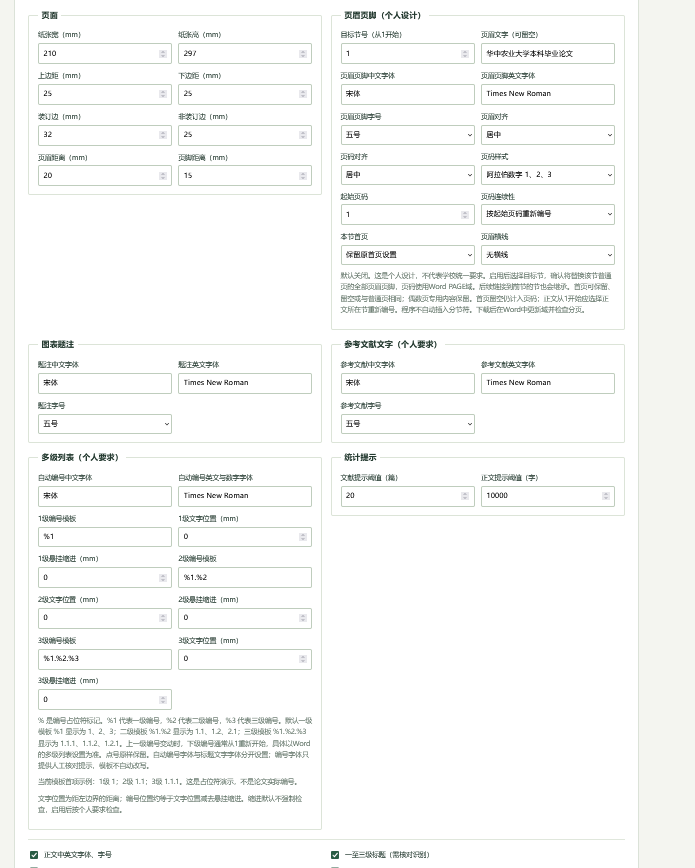

# 狮山论文助手

面向华中农业大学本科论文的格式检查与确认修改工具。支持自定义规则，在浏览器内处理 `.docx`，预览并确认选中的修改后生成副本，保留原稿。

**状态：v0.24 测试版 · 学生个人项目 · 非学校官方工具。** 提供人文社科类、自然科学类及自定义方案；不代表适用于所有学院、专业或毕业年级。

[功能边界](docs/limitations.md) · [规则来源](docs/rules.md) · [更新记录](CHANGELOG.md) · [贡献指南](CONTRIBUTING.md)

## 在线使用

[打开狮山论文助手](https://lyydw-0907.github.io/shishan-thesis-assistant/)

公开在线版由 GitHub Pages 托管。部署自己的版本可使用下方方法。

## 能做什么

| 功能 | 检查与处理方式 |
| --- | --- |
| 正文结构提示 | 按两类本科方案识别章节名称，支持常见别名及合并章节；未识别只提示核对，不自动改名 |
| 正文与三级标题 | 分别检查中文、英文字体及中文字号；标题分类可人工纠正 |
| 多级列表 | 识别层级、模板及继承；安全条件满足时可确认修改标题编号字号、列表缩进 |
| 页面设置 | 检查分节纸张、边距与页眉页脚距离；可确认切换镜像页边距 |
| 页眉页脚与页码 | 按节显示编号格式、起始设置及有效 PAGE 域；可启用个人页眉页脚设计 |
| 图表题注 | 覆盖普通段落及表格单元格；检查编号、正文引用和邻近结构位置；可选中英文字体与字号修改 |
| 文献与引用 | 提示条目数量、重复、常见数字与作者—年份引用对应；可启用著录字段筛查 |
| 字数与公式 | 按说明口径估算分类及全文字数；识别 Word 公式对象，提示需人工核对的内容 |
| 修改副本 | 全选或逐项选择、预览确认、生成副本、自动复检及内容保留校验；下载报告和修改对照 |

“通过”表示该项在支持范围内符合所选规则，不等于论文全部合格。实际分页、公式语义与复杂布局详见[功能边界](docs/limitations.md)。

## 操作步骤

1. 选择 `.docx` 文件，大小不超过 20 MB。
2. 选择人文社科类、自然科学类或自定义方案；可调整、保存或导入规则。默认关闭的个人要求需要手动启用。
3. 开始检查，核对段落识别；必要时指定正文起点或修改段落分类，再重新检查。
4. 查看题注、引用、分节页码等明细，区分可修改项和人工核对项。
5. 勾选修改项或使用全选，打开预览，确认修改范围后生成副本。
6. 下载修改副本、复检报告及修改对照。在 Word 中更新域并核对目录、页码、跨页与公式显示。

文件或规则改变后需要重新检查。程序不覆盖原文件；“清除本次检查”、刷新或关闭页面会清除会话，请及时下载结果。

## 界面示意

下图为已有早期设置页截图，不含论文内容；当前版本布局、字段及说明已有更新，以运行页面为准。



## 隐私与处理方式

论文 ZIP/XML 的解析、检查与修改均在浏览器内执行，不提交论文到服务器，不调用模型 API。个人方案保存在当前浏览器的 localStorage；原稿、检查记录和修改结果在当前页面会话中处理。GitHub正式在线版接入Cloudflare Web Analytics，前台不显示统计数字。网站所有者在Cloudflare后台查看浏览及性能数据；本地文件、开发预览及原演示站点不加载统计脚本。应用不向统计服务提交论文、文件名或检查结果。第三方统计脚本的收集范围以Cloudflare的说明为准（https://developers.cloudflare.com/web-analytics/about/）。网页加载本身仍需要网络，托管平台可能记录常规访问日志；自行部署时若增加分析脚本或上传功能，需要另行说明。

仓库的自动测试使用构造的文档内容，不包含用户上传的论文。反馈问题时请提供匿名最小复现样例，勿提交完整未公开论文、姓名、学号等信息。

## 本地运行与部署

应用是静态 HTML/JavaScript，无后端与构建步骤。推荐通过 localhost 或 HTTPS 使用，浏览器需要支持 Web Crypto、DOMParser 和现代 JavaScript。

```bash
python3 -m http.server 8080 --directory dist
```

打开 `http://localhost:8080`。Python 仅用于启动本地静态服务器，不参与论文处理。

### GitHub Pages

将项目上传至 GitHub 后，可使用仓库内的 `.github/workflows/pages.yml`：

1. 在仓库 Settings → Pages 中，将 Source 设置为 GitHub Actions。
2. 推送到 `main`，或在 Actions 页面手动运行 “Deploy static site to Pages”。
3. 工作流只上传 `dist/`，完成后使用 GitHub 返回的 Pages 地址。

该流程发布网页，不会上传本地论文。学校校徽是第三方标识资源，参见[资源说明](THIRD_PARTY_NOTICES.md)；按自己的发布用途决定保留或替换。

## 测试与项目结构

```bash
npm install --prefix tests --ignore-scripts
npm test --prefix tests
```

测试覆盖段落样式继承、列表、页眉页脚、题注、文献引用、字数、确认修改、内容保留和复检。通过自动测试不代表完成桌面 Word 的全部视觉兼容性验证。

- `dist/index.html`：页面与交互。
- `dist/engine.js`：浏览器 OOXML 检查与修改引擎。
- `dist/vendor/`：本地打包的 JSZip 与许可证。
- `tests/`：使用合成夹具的自动测试。
- `docs/`：规则、限制及界面示意。

## 规则依据与许可证

规则来源、文号、适用范围及个人默认值见 [docs/rules.md](docs/rules.md)。本项目不宣称采用学校最新且适用于所有专业的统一模板；学院或当年要求有变化时，请调整方案。

原创代码与项目文档采用 [MIT License](LICENSE)。第三方库及学校校徽适用各自条款，详见 [THIRD_PARTY_NOTICES.md](THIRD_PARTY_NOTICES.md)。
